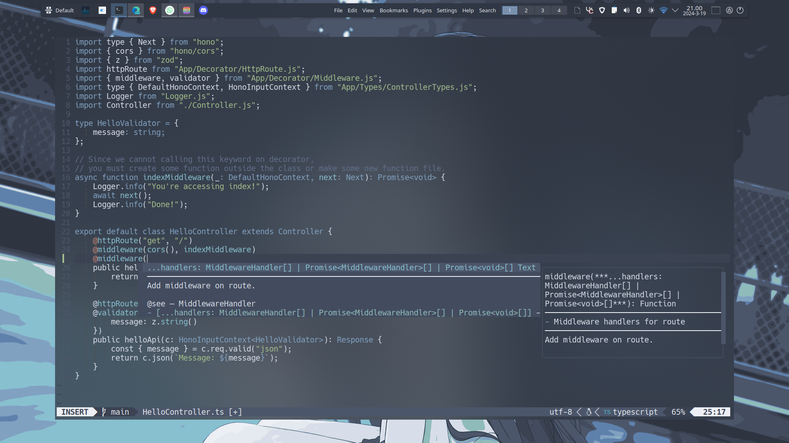
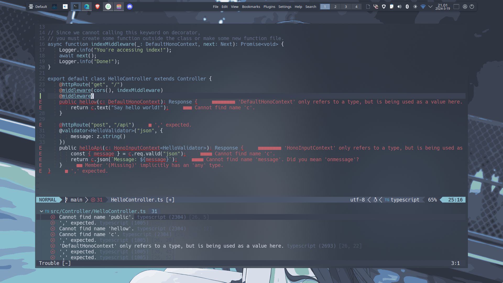

This is my primary (neo)vim configuration.

## How to install
1. Copy this folder in `~/.config`.
2. Install all fonts in this root folder.
3. Open `nvim` or `nvim-qt` first to install all the dependency.
4. Do nothing and done!

### Bonus Step (if you're using Windows)
1. Open `right_click_menu.reg` with Notepad and change the location that `nvim-qt` located.
2. Execute `right_click_menu.reg`.

## Screenshot

